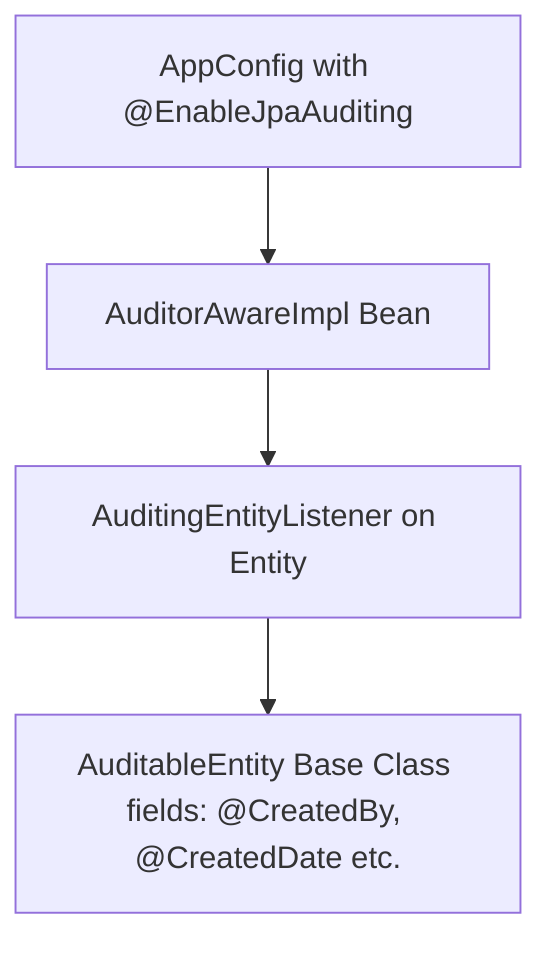

# Spring Boot Study & Revision Notes (Week 4: Prod Features)

This notes file covers the core concepts, configurations, and connections of **ModelMapper**, **Spring Security (Basic)**, **JPA Auditing**, and **Spring Data Envers (Revisions)**.

---

## 🗺️ 1. ModelMapper Configuration & Mapping
ModelMapper ka main purpose entity classes ko DTOs (Data Transfer Objects) aur DTOs ko entity classes me automatically map karna hai taaki hume manually long code `setXXX(getXXX)` na likhna pade.

### Configuration (`AppConfig.java`)
Hume ModelMapper ko ek `@Bean` ke roop me define karna hota hai taaki hum isko kisi bhi Service me `@Autowired` ya constructor injection se use kar sakein.
```java
@Configuration
public class AppConfig {
    @Bean
    public ModelMapper getModelMapper() {
        return new ModelMapper();
    }
}
```

### Key Operations in Service (`PostServiceImpl.java`)

1. **Entity to DTO Mapping (Single Object)**:
   ```java
   PostDto dto = modelMapper.map(postEntity, PostDto.class);
   ```

2. **DTO to Entity Mapping (Create)**:
   ```java
   PostEntity post = modelMapper.map(dto, PostEntity.class);
   ```

3. **Updating Existing Entity (Crucial ⚠️)**:
   Existing database record ko incoming DTO data se update karne ke liye:
   ```java
   // Map DTO fields to existing entity (dest object directly update hoga)
   modelMapper.map(postDto, existingPost);
   
   // ⚠️ ModelMapper warning: DTO me agar ID null hai, toh existingPost ki ID bhi overwrite ho sakti hai!
   // Isliye, ID ko explicitly wapas set karna safe rehta hai:
   existingPost.setId(postId); 
   ```

4. **List Mapping (Streams API)**:
   ```java
   List<PostEntity> posts = productRepository.findAll();
   return posts.stream()
               .map(post -> modelMapper.map(post, PostDto.class))
               .toList();
   ```

---

## 🔒 2. Web Security Configuration (Spring Security Basic)
Spring Security request incoming paths ko filter karti hai authentication aur authorization ke liye.

### Configuration (`WebSecurityConfig.java`)
```java
@Configuration
@EnableWebSecurity
public class WebSecurityConfig {

    @Bean
    public SecurityFilterChain securityFilterChain(HttpSecurity http) throws Exception {
        http
            .csrf(csrf -> csrf.disable()) // CSRF disable: Postman se POST/PUT requests easily kaam karein
            .authorizeHttpRequests(auth -> auth
                .anyRequest().authenticated() // Saari requests authenticated honi chahiye
            )
            .httpBasic(Customizer.withDefaults()); // HTTP Basic Auth enable
        return http.build();
    }
}
```

### Key Security Concepts to Understand:
- **CSRF (Cross-Site Request Forgery)**: Browser-based attacks se bachane ke liye hota hai. API-only microservices ya development testing (Postman) me hum ise disable kar dete hain taaki `POST/PUT/DELETE` requests bina CSRF token header ke reject na hon.
- **HTTP Basic Auth**: Client request headers me `Authorization: Basic <base64(username:password)>` bhejta hai. By default, Spring Boot app starting me screen par ek random security password generate karta hai jisko hum use karte hain. Username properties file me predefined hai (`spring.security.user.name = user`).

---

## 📝 3. JPA Auditing & AuditorAware Connection
JPA Auditing hume records kab create hue, kisne kiye, kab update hue, aur kisne update kiye, automatically tracks karne me help karta hai.

### The Big Connection (4 Components):



1. **Base Class (`AuditableEntity.java`)**:
   Common fields ko contain karta hai. Isme `@MappedSuperclass` aur `@EntityListeners(AuditingEntityListener.class)` dynamic behavior handle karne ke liye use hota hai.
   ```java
   @MappedSuperclass
   @Data
   @EntityListeners(AuditingEntityListener.class)
   public class AuditableEntity {
       @CreatedDate
       @Column(nullable = false, updatable = false)
       private LocalDateTime date;

       @LastModifiedDate
       private LocalDateTime updatedDate;

       @CreatedBy
       private String createdBy;

       @LastModifiedBy
       private String updatedBy;
   }
   ```

2. **AuditorAware Implementation (`AuditorAwareimpl.java`)**:
   Batata hai ki log-in user kaun hai (jo `@CreatedBy` aur `@LastModifiedBy` fields me save hoga).
   ```java
   public class AuditorAwareimpl implements AuditorAware<String> {
       @Override
       public Optional<String> getCurrentAuditor() {
           // Dynamic system me hum Spring Security Context se current user nikalte hain.
           // Temporary testing ke liye hardcoded string:
           return Optional.of("sourav thakur ");
       }
   }
   ```

3. **Registering the Bean in Config (MISSING ⚠️)**:
   Spring ko batana padta hai ki AuditorAware bean active hai. Ise `AppConfig.java` me add karna jaruri hai:
   ```java
   @Bean
   public AuditorAware<String> auditorAware() {
       return new AuditorAwareimpl();
   }
   ```

4. **Entity Class (`PostEntity.java`)**:
   Base class ko inherit karegi:
   ```java
   @Entity
   public class PostEntity extends AuditableEntity { ... }
   ```

---

## 📜 4. Spring Data Envers (Entity Revision History)
Envers data updates ka version history (audit logs) track karne ke liye hai. Har update par database me ek parallel history `_AUD` table banti hai.

### Implementation Checklist:
1. **Dependency**: Ensure standard `spring-data-envers` is added in `pom.xml`.
2. **Annotation**: Add `@Audited` on Entity level (`PostEntity.java`).
3. **Repository**: Inherit `RevisionRepository<EntityClass, ID_Type, Revision_Number_Type>`:
   ```java
   public interface ProductRepository
           extends JpaRepository<PostEntity, Long> , RevisionRepository<PostEntity, Long, Integer> {
   }
   ```
4. **Fetching History (`PostServiceImpl.java`)**:
   `productRepository.findRevisions(postId)` return karta hai saare database revisions.
   ```java
   public void getPostHistory(Long postId) {
       Revisions<Integer, PostEntity> revisions = productRepository.findRevisions(postId);
       for (Revision<Integer, PostEntity> revision : revisions) {
           System.out.println("Revision Number: " + revision.getRequiredRevisionNumber());
           System.out.println("Revision Date: " + revision.getRequiredRevisionInstant());
           System.out.println("Post Data in this revision: " + revision.getEntity());
       }
   }
   ```
