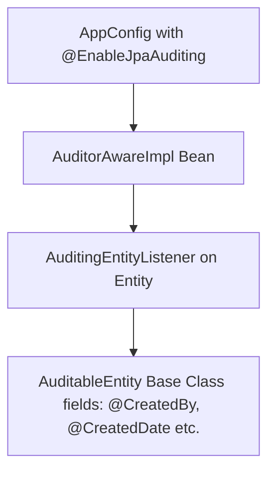

# Spring Boot Study Guide: RestClient, JPA Auditing & Spring Data Envers

This study guide provides a comprehensive review of **JPA Auditing**, **Spring Data Envers**, and **Spring Boot RestClient**. It contains detailed theory explanations, real-world examples, step-by-step configurations, and crucial interview-style Questions & Answers.

---

## 🗺️ Part 1: Spring Boot RestClient

### 1.1 Core Concepts & Theory
`RestClient` is a modern, synchronous HTTP client introduced in Spring Boot 3.2 (Spring Framework 6.1). Before its introduction, developers primarily relied on:
* **RestTemplate**: Old, template-based, exposes too many overloaded methods, and doesn't offer a modern fluent API.
* **WebClient**: Reactive, fluent, but requires the `spring-boot-starter-webflux` dependency and is heavier for synchronous-only applications.

`RestClient` offers the best of both worlds: a fluent, builder-style API (similar to `WebClient`) but designed for synchronous, blocking HTTP communication.

### 1.2 Key Operations & Syntax
`RestClient` utilizes a builder pattern to execute HTTP requests:

* **Initialization**:
  ```java
  RestClient restClient = RestClient.builder()
          .baseUrl("https://api.example.com")
          .defaultHeader("Content-Type", "application/json")
          .build();
  ```
* **GET Requests**:
  ```java
  List<EmployeeDto> list = restClient.get()
          .uri("/employees")
          .retrieve()
          .body(new ParameterizedTypeReference<List<EmployeeDto>>() {});
  ```
* **POST Requests**:
  ```java
  EmployeeDto newEmployee = restClient.post()
          .uri("/employees")
          .body(employeeDto)
          .retrieve()
          .body(EmployeeDto.class);
  ```
* **Handling Wrappers (Generic Return Types)**: When a server wraps response data in a generic envelope (e.g. `ApiResponse<T>`), use `ParameterizedTypeReference` to avoid type erasure:
  ```java
  ApiResponse<EmployeeDto> response = restClient.get()
          .uri("/employees/{id}", 1L)
          .retrieve()
          .body(new ParameterizedTypeReference<ApiResponse<EmployeeDto>>() {});
  EmployeeDto dto = response.getData();
  ```

### 1.3 Real-Life Example
In microservices architectures, an **Order Service** needs to call a **Payment Gateway API** synchronously to check payment status before authorizing a shipment:
```java
public PaymentStatus checkPayment(String transactionId) {
    return restClient.get()
            .uri("/payments/{txId}", transactionId)
            .retrieve()
            .onStatus(HttpStatusCode::is4xxClientError, (req, res) -> {
                throw new PaymentFailedException("Invalid transaction ID");
            })
            .body(PaymentStatus.class);
}
```

### 1.4 Interview Q&A
* **Q1: What is type erasure, and how does `ParameterizedTypeReference` solve it in RestClient?**
  * **A**: In Java, generics are erased at runtime. If we call `.body(List.class)` or `.body(ApiResponse.class)`, Jackson won't know the exact class (like `EmployeeDto`) to map inside the list or wrapper. `ParameterizedTypeReference` captures generic type details at compile-time and keeps them available at runtime, allowing Jackson to deserialize nested structures correctly.
* **Q2: How do you handle HTTP errors in RestClient without throwing generic exceptions?**
  * **A**: Use `.onStatus()` handler in the execution chain. It lets you target specific HTTP Status codes (like `4xx` or `5xx`) and map them to custom domain exceptions:
    ```java
    .onStatus(status -> status.value() == 404, (req, res) -> {
        throw new ResourceNotFoundException("Entity not found");
    })
    ```

---

## 📝 Part 2: JPA Auditing

### 1.1 Core Concepts & Theory
JPA Auditing allows you to track modifications made to database entities. In enterprise systems, it is essential to log:
* **Who** created the record.
* **When** it was created.
* **Who** last modified the record.
* **When** it was last modified.

Instead of writing manual logging code in service methods, Spring Data JPA automates this using entity lifecycle listeners.

### 2.2 The 4-Component Connection
JPA Auditing relies on the dynamic connection of four main parts:



1. **Configuration**: `@EnableJpaAuditing` enables auditing features globally in your Spring context.
2. **Auditor Tracker**: An implementation of `AuditorAware<T>` tells Spring *who* the current user is.
3. **Entity Listener**: `@EntityListeners(AuditingEntityListener.class)` is registered on the entity class. It intercepts entity persistence events (inserts/updates).
4. **Auditing Fields**: Base class fields decorated with `@CreatedDate`, `@LastModifiedDate`, `@CreatedBy`, and `@LastModifiedBy`.

### 2.3 Setup & Configuration Code
* **Base Auditable Entity**:
  ```java
  @MappedSuperclass
  @EntityListeners(AuditingEntityListener.class)
  @Data
  public abstract class AuditableEntity {
      @CreatedDate
      @Column(nullable = false, updatable = false)
      private LocalDateTime date;

      @LastModifiedDate
      private LocalDateTime updatedDate;

      @CreatedBy
      private String createdBy;

      @LastModifiedBy
      private String updatedBy;
  }
  ```
* **AuditorAware Implementation (Extracting user from Spring Security context)**:
  ```java
  public class AuditorAwareImpl implements AuditorAware<String> {
      @Override
      public Optional<String> getCurrentAuditor() {
          Authentication authentication = SecurityContextHolder.getContext().getAuthentication();
          if (authentication == null || !authentication.isAuthenticated()) {
              return Optional.of("SYSTEM");
          }
          return Optional.of(authentication.getName());
      }
  }
  ```
* **Registering the Config**:
  ```java
  @Configuration
  @EnableJpaAuditing
  public class AppConfig {
      @Bean
      public AuditorAware<String> auditorAware() {
          return new AuditorAwareImpl();
      }
  }
  ```

### 2.4 Real-Life Example
In banking applications, when a new bank account or transactions are created, standard compliance requires writing a permanent log of which banker created it and when. Inheriting `AuditableEntity` automates this requirement completely, ensuring no audit column is left blank.

### 2.5 Interview Q&A
* **Q1: What is the purpose of `@MappedSuperclass`?**
  * **A**: `@MappedSuperclass` indicates that a class designates parent mapping information. The fields defined in it (like `date`, `createdBy`) are inherited by subclass entities and mapped directly to their database tables. The parent class itself does not have a corresponding database table.
* **Q2: Why should we prefer JPA Auditing over manually writing `onCreate()` and `onUpdate()` method lifecycle hooks?**
  * **A**: Manually managing dates and usernames violates the DRY (Don't Repeat Yourself) principle. It requires writing boilerplate methods across every entity. JPA Auditing decouples this logic from entities and uses a centralized `AuditorAware` bean, ensuring standard auditing behaviors across the entire system.

---

## 📜 Part 3: Spring Data Envers (Revision History)

### 3.1 Core Concepts & Theory
While JPA Auditing stores only the **latest state** of an entity (who last updated it), **Spring Data Envers** creates a historical timeline of **every state** the entity has ever been in. 
Whenever a row is inserted, updated, or deleted, Envers copies the old state into a shadow table (usually suffixed with `_AUD`) and links it to a global revision table (`REVINFO`) containing a timestamp.

### 3.2 Setup Checklist
1. **Dependency**: Add `spring-data-envers` in `pom.xml`.
2. **Entity Annotation**: Decorate the entity with `@Audited`.
3. **Config**: Configure your Spring Data repositories to support Envers by overriding the factory bean class:
   ```java
   @EnableJpaRepositories(
       repositoryFactoryBeanClass = EnversRevisionRepositoryFactoryBean.class,
       basePackages = "week4.example.prodfeatures.repositories"
   )
   ```
4. **Repository Class**: Extend `RevisionRepository<EntityClass, ID_Type, Revision_Number_Type>`:
   ```java
   public interface ProductRepository
           extends JpaRepository<PostEntity, Long>, RevisionRepository<PostEntity, Long, Integer> {
   }
   ```

### 3.3 Fetching Audit Logs
```java
public void printHistory(Long postId) {
    Revisions<Integer, PostEntity> revisions = productRepository.findRevisions(postId);
    for (Revision<Integer, PostEntity> rev : revisions) {
        System.out.println("Revision: " + rev.getRequiredRevisionNumber());
        System.out.println("Date: " + rev.getRequiredRevisionInstant());
        System.out.println("Data: " + rev.getEntity());
    }
}
```

### 3.4 Real-Life Example
In Content Management Systems (CMS), editors need to view past drafts of an article and restore a previously saved state if a mistake is made. Envers automatically tracks all revisions of the article, enabling full rollback capability out of the box.

### 3.5 Interview Q&A
* **Q1: How does Envers structure database tables?**
  * **A**: For an entity table named `POST`, Envers creates a secondary audit table named `POST_AUD`. This table contains all fields of `POST`, plus two auditing columns: `REV` (the Revision ID) and `REVTYPE` (0 for Insert, 1 for Update, 2 for Delete). `REVINFO` is a global table mapping `REV` IDs to epoch timestamps.
* **Q2: How do you configure selective field auditing in Envers?**
  * **A**: Place `@Audited` on the entity class, and annotate any fields you want to exclude from historical tracking with `@NotAudited`.
